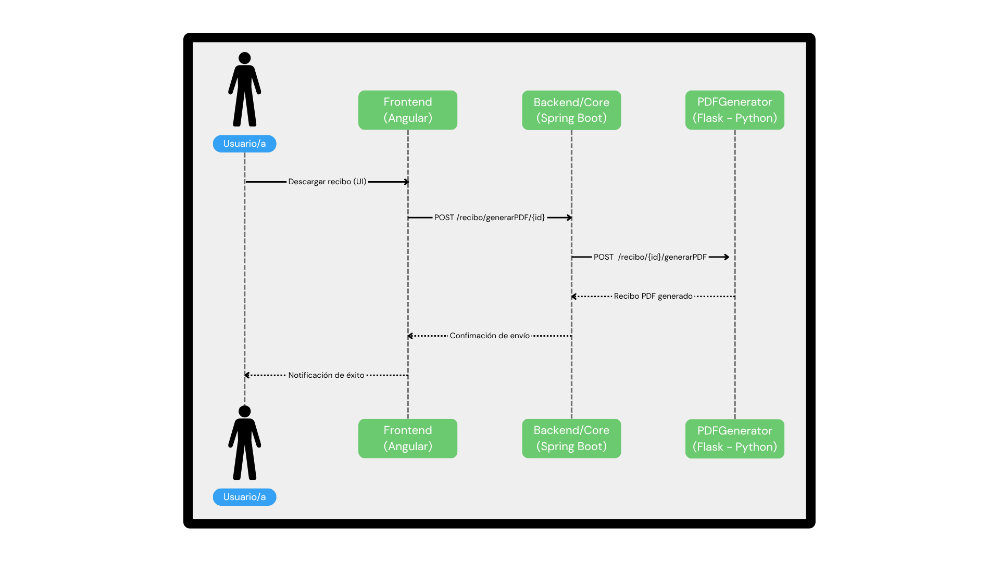
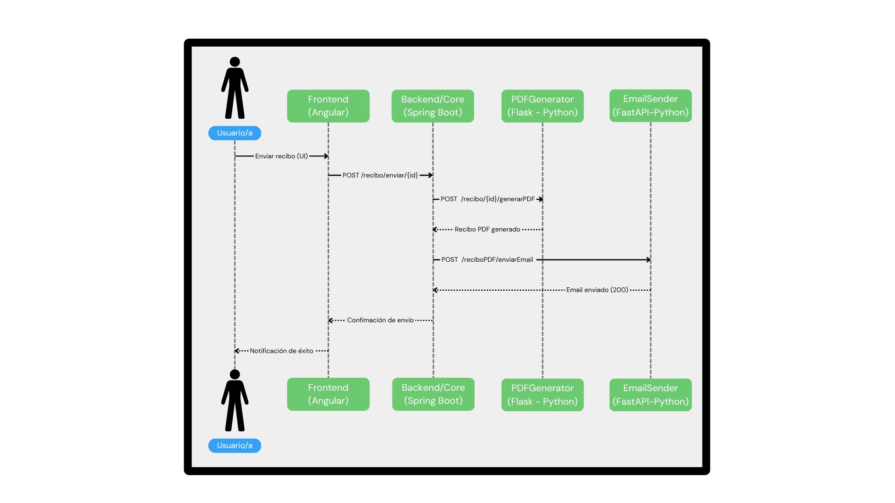

# **Gestión de Comunidades**

 [ Español](/README.md) &#124; [ English](./docs/README_EN.md) 

Este repositorio contiene el desarrollo del proyecto correspondiente al módulo **MP0492 _Proxecto de desenvolvemento de aplicacións multiplataforma_**.  

  ##  **Índice**

 - [📘 Sobre el Proyecto](#sobre-el-proyecto)  
 - [🎯 Objetivos](#objetivos)  
 - [🔗 Componentes del Sistema](#componentes-del-sistema)  
 - [🗄️ Estructura del proyecto](#estructura-del-proyecto)  
 - [🧾 Diagrama de Secuencia](#diagrama-de-secuencia)  
 - [🎬 Demo](#demo)  
 - [🚀 Deployment](#deployment)  
 - [🌱 Perspectiva a futuro e ideas](#perspectiva-a-futuro-e-ideas)  
 - [💻 Tecnologías](#tecnologías)  
 - [👤 Autor](#autor)
---

## **Sobre el Proyecto**

**Gestión de Comunidades** es una aplicación web modular desarrollada para digitalizar y modernizar la administración de comunidades de vecinos, especialmente dirigida a pequeñas administraciones que no pueden permitirse soluciones ERP complejas y costosas.

Este proyecto nace como respuesta a la necesidad de **mejorar** la **eficiencia** administrativa, la **trazabilidad** de la información y la **comunicación** entre administradores y propietarios/as.  

Tras realizar una breve encuesta en la provincia de **Pontevedra**, se constató que aún existen numerosas administraciones de comunidades que gestionan sus tareas de forma manual.

Para obtener más información sobre la motivación del proyecto, consultar el siguiente pdf 👉 [Presentación del proyecto](./docs/gestion_comunidades.pdf)

##  **Objetivos**

### **Objetivo General**
Desarrollar una solución web que permita centralizar la información relevante, automatizar tareas rutinarias como la generación de recibos y facilitar la comunicación mediante notificaciones por correo electrónico.

### **Objetivos Específicos**
- **Centralizar Datos**: Reunir toda la información relevante en una sola plataforma.
- **Automatizar Procesos**: Eliminar tareas manuales con funciones automatizadas.
- **Mejorar la Comunicación**: Facilitar el envío de notificaciones a propietarios/as mediante servicios de correo electrónico.

### **Objetivo Personal**
Reunir y demostrar conceptos adquiridos y trabajados. Para ello se afronta todo el proceso de desarrollo de una aplicación, desde una idea hasta su ejecución.

1. Realizar encuestas en el sector para determinar las carencias.
2. Abordar posibles arquitecturas y deliberar sobre las entidades que van a rodear al sistema y el comportamiento de las mismas.
3. Generar y diseñar diagramas: 
   - Casos de uso
   - Secuencia
   - Entidad Relación
4. Elegir el stack tecnológico.
5. Implementar todos los componentes del sistema e integrar sus servicios.
6. DevOps. Materializar el despliegue, gracias a la '**Dockerización**' de las aplicaciones.


##  **Componentes del Sistema**
Son varios los proyectos que se cohesionan evitando el acoplamiento para aplicar las funcionalidades requeridas:
- **Core**: Lógica de negocio y gestión de datos implementada con Spring Boot.
- **Frontend**: Interfaz de usuario desarrollada en Angular.
- **Microservicios**:
  - `EmailSender`: Envío automático de correos electrónicos.
  - `PDFGenerator`: Generación dinámica de documentos en formato PDF.
- **Base de Datos**: Sistema de persistencia para las entidades del dominio.


## **Estructura del proyecto**

```yml
gestion-comunidades
├── 📁 docs/                   # Documentación y recursos complementarios
├── 📁 core/                   # Backend principal en Spring Boot
├── 📁 frontend/               # Frontend en Angular
├── 📄 docker-compose.yml      # Despligue DDBB y servicios dockerizados
└── 📁 microservices               
        ├── 📁 emailsender/    # Microservicio Python para email
        ├── 📁 pdfgenerator/   # Microservicio Python para generación de PDFs               
```


##  **Diagrama de Secuencia** 
A continuación se representan diagramas de secuencia que muestra el flujo de ejecución de las principales acciones con el sistema.
### **Dar de alta una comunidad**
   

### **Generar un recibo en formato PDF**

 

### **Enviar recibo por email**
 

##  **Demo**
Mediante el siguiente contenido multimedia se muestran fragmentos de una demo donde se aplican las acciones más relevantes del proyecto.

### **Dashboard**
Panel informático que resume toda la *data* que existe en el sistema.
 

 ### **Dar de alta una comunidad**
Proceso para añadir una nueva comunidad al sistema.
 

 ### **Visualizar la información** 
Obtener los datos que pertenecen a la comunidad (propiedades, propietarios/as, recibos...)
 

  ### **Introducir un nuevo recibo**
  Generar un recibo para una comunidad.
 

  ### **Generar y descargar un recibo**
 - De Comunidad
   

- De propietarios/as  
La acción anterior desencadena la disponibilidad para la generación del recibo para los propietarios/as.
 

 ### **Envío de recibo por email** 
Esta función emite la generación de un recibo para posteriormente enviarlo por email a la persona vinculada.
 

 
##  **Deployment**
###  **Docker Compose**

```yml
services:
  postgres:
    image: postgres:15
    container_name: postgres_commune
    env_file:
      - .env
    volumes:
      - ./docker/postgres/data:/var/lib/postgresql/data
    ports:
      - "${POSTGRES_PORT}:5432"
    networks:
      - commune-network
    healthcheck:
      test: ["CMD", "pg_isready", "-U", "postgres"]
      interval: 5s
      timeout: 5s
      retries: 5

  frontend:
    build: ./frontend
    container_name: angular_commune
    ports:
      - "4200:80"
    depends_on:
      - postgres
    networks:
      - commune-network

  backend:
    build: ./core
    container_name: backend_commune
    ports:
      - "3000:3000"
    depends_on:
      - postgres
    networks:
      - commune-network

  emailsender:
    build: ./microservices/emailsender
    container_name: emailsender
    networks:
      - commune-network
    environment:
      - ENV=prod
    

  pdfgenerator:
    build: ./microservices/pdfgenerator
    container_name: pdfgenerator
    networks:
      - commune-network
    environment:
      - ENV=prod
networks:
  commune-network:
```
Previamente se levanta PostgreSQL
```bash
docker compose up -d postgres
```
### **Core**
El corazón del sistema. Este servicio es el que orquesta la integración del resto de componentes al sistema.

Generar DockerFile y levantar el servicio
```bash
docker compose build backend --no-cache
docker compose up -d backend
```

### **Frontend**
Interfaz para el usuario que accede al sistema.

Generar DockerFile y levantar el servicio
```bash
docker compose build frontend --no-cache
docker compose up -d frontend
```

### **PDFGeneartor**
Microservicio encargado de la maquetación y generación dinamica de recibos en formato PDF.

Generar DockerFile y levantar el servicio
```bash
docker compose build pdfgenerator --no-cache
docker compose up -d pdfgenerator
```

### **EmailSender**
Microservicio con la responsabilidad de ejecutar los envíos masivos de mail desde la interfaz gráfica.

Generar DockerFile y levantar el servicio
```bash
docker compose build emailsender --no-cache
docker compose up -d emailsender
```

### **Pasos previos**
Asegúrate de completar y configurar las variables de entorno definidas en los **`.env.example`**
### **Pasos posteriores**
Accede desde el navegador web Angular: http://localhost:4200/dashboard


##   **Perspectiva a futuro e ideas**
- Autenticación de usuarios.
- Escalabilidad del sistema para integrar servicios de otros sectores relacionados.
- Aplicación móvil para propietarios/as o en su defecto acceso Web.
- Gestión de incidencias.
- Votaciones online.

---

## **Tecnologías**


---


## **Autor**

Yeray Oubiña Rey  
📍 España  
📧 yeray.oubina.rey@gmail.com  
🔗 [GitHub](https://github.com/youbinarey)  
🔗 [Linkedin](https://www.linkedin.com/in/yerayoubinarey/)

---

