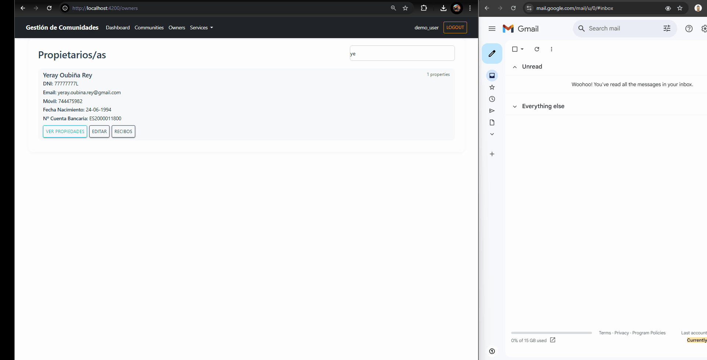

# **Community Management**
 [ Español](/README.md) | [ English](./README_EN.md)   

This repository contains the development of the project for the module **MP0492 _Multiplatform Application Development Project_**.

## **About the Project**

**Community Management** is a modular web application developed to digitalize and modernize the administration of homeowners’ associations, especially aimed at small property managers who cannot afford complex and expensive ERP solutions.

This project was created to address the need to **improve** administrative **efficiency**, **traceability** of information, and **communication** between managers and property owners.

After conducting a brief survey in the province of **Pontevedra**, it was found that many community management offices still handle their tasks manually.

For more information about the project, see 👉 [Community Management PDF](./gestion_comunidades.pdf)

## 🎯 **Objectives**

### **General Objective**
Develop a web solution that centralizes relevant information, automates routine tasks like invoice generation, and facilitates communication via email notifications.

### **Specific Objectives**
- **Centralize Data**: Gather all relevant information on a single platform.
- **Automate Processes**: Eliminate manual tasks through automated features.
- **Improve Communication**: Facilitate notification sending to property owners via email services.

### **Personal Objective**
Bring together and demonstrate the concepts acquired and practiced. This involves the entire process of developing an application, from idea to execution.

1. Conduct surveys in the sector to determine needs.
2. Explore possible architectures and define the system’s entities and their behavior.
3. Generate and design diagrams:
   - Use Cases
   - Sequence
   - Entity Relationship
4. Choose the tech stack.
5. Implement all system components and integrate their services.
6. DevOps: Deploy using '**Dockerization**' of the applications.

## 🔗 **System Components**
Several projects work together, avoiding coupling, to provide the required features:
- **Core**: Business logic and data management implemented with Spring Boot.
- **Frontend**: User interface developed in Angular.
- **Microservices**:
  - `EmailSender`: Automatic email sending.
  - `PDFGenerator`: Dynamic PDF document generation.
- **Database**: Persistence system for domain entities.

## 🗄️ **Project Structure**
```yml
community-management
├── 📁 docs/                   # Documentation and supplementary resources
├── 📁 core/                   # Main backend in Spring Boot
├── 📁 frontend/               # Angular frontend
├── 📄 docker-compose.yml      # Dockerized DB and service deployment
└── 📁 microservices
        ├── 📁 emailsender/    # Python microservice for email
        ├── 📁 pdfgenerator/   # Python microservice for PDF generation
```

## 🧾 **Sequence Diagram**
Below are sequence diagrams showing the execution flow of the main actions in the system.
### **Register a Community**


### **Generate a PDF Receipt**


### **Send Receipt by Email**


## 🎬 **Demo**
The following multimedia content shows key actions in the project.

### **Dashboard**
Dashboard summarizing all data in the system.


### **Register a New Community**
Process to add a new community to the system.


### **View Information**
Retrieve community data (properties, owners, receipts, etc.)


### **Enter a New Receipt**
Generate a receipt for a community.


### **Generate and Download a Receipt**
- Community receipt


- Owners’ receipts  
The previous action triggers the option to generate receipts for individual owners.


### **Send Receipt by Email**
This function generates a receipt and sends it via email to the relevant person.


## 🚀 **Deployment**
###  **Docker Compose**
```yml
services:
  postgres:
    image: postgres:15
    container_name: postgres_commune
    env_file:
      - .env
    volumes:
      - ./docker/postgres/data:/var/lib/postgresql/data
    ports:
      - "${POSTGRES_PORT}:5432"
    networks:
      - commune-network
    healthcheck:
      test: ["CMD", "pg_isready", "-U", "postgres"]
      interval: 5s
      timeout: 5s
      retries: 5

  frontend:
    build: ./frontend
    container_name: angular_commune
    ports:
      - "4200:80"
    depends_on:
      - postgres
    networks:
      - commune-network

  backend:
    build: ./core
    container_name: backend_commune
    ports:
      - "3000:3000"
    depends_on:
      - postgres
    networks:
      - commune-network

  emailsender:
    build: ./microservices/emailsender
    container_name: emailsender
    networks:
      - commune-network
    environment:
      - ENV=prod

  pdfgenerator:
    build: ./microservices/pdfgenerator
    container_name: pdfgenerator
    networks:
      - commune-network
    environment:
      - ENV=prod
networks:
  commune-network:
```

Start PostgreSQL first:
```bash
docker compose up -d postgres
```

### **Core**
The heart of the system. This service orchestrates the integration of other components.

Build DockerFile and start the service:
```bash
docker compose build backend --no-cache
docker compose up -d backend
```


### **Frontend**
User interface of the system.  
Build DockerFile and start the service:
```bash
docker compose build frontend --no-cache
docker compose up -d frontend
```


### **PDFGenerator**
Microservice for dynamic receipt layout and PDF generation.

Build DockerFile and start the service:
```bash
docker compose build pdfgenerator --no-cache
docker compose up -d pdfgenerator
```


### **EmailSender**
Microservice responsible for sending mass emails from the graphical interface.

Build DockerFile and start the service:
```bash
docker compose build emailsender --no-cache
docker compose up -d emailsender
```


### **Preliminary Steps**
Make sure to complete and configure the environment variables defined in **`.env.example`**
### **Next Steps**
Access the web dashboard via Angular at: http://localhost:4200/dashboard

## 🌱  **Future Perspective & Ideas**
- User authentication.
- Scalability to integrate services from related sectors.
- Mobile app for owners or, alternatively, web access.
- Incident management.
- Online voting.

---

## **Technologies**


---

## 👤 Author

Yeray Oubiña Rey  
📍 Spain  
📧 yeray.oubina.rey@gmail.com  
🔗 [GitHub](https://github.com/youbinarey)  
🔗 [Linkedin](https://www.linkedin.com/in/yerayoubinarey/)

---
